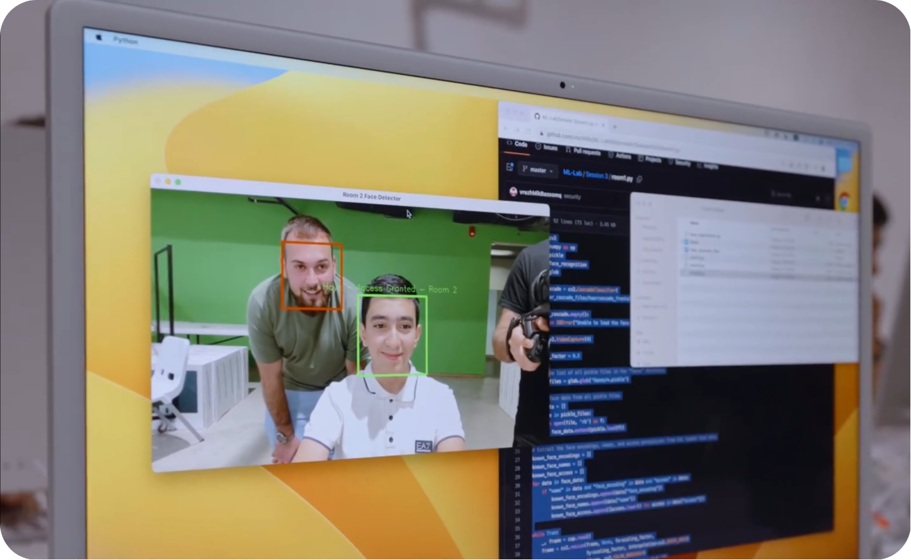

<div align="center">
	<h1>Face Recognition System</h1>
	<h4>#Python #OpenCV #RaspberryPi #ML</h4>
	
</div>

## Introduction
This repository showcases the culmination of the "Machine Learning with Raspberry Pi" workshop led by Vrezh Mikayelyan at TUMO Center for Creative Technologies. The workshop covered fundamental concepts such as utilizing Raspberry Pi for machine learning projects, basic data visualization, mathematical operations in Python, and image manipulation using OpenCV.

**About Raspberry Pi:**
Raspberry Pi is a series of small, affordable, and customizable single-board computers developed by the Raspberry Pi Foundation in the United Kingdom. It is designed to promote the teaching of basic computer science in schools and developing countries. These credit card-sized computers have gained popularity for various applications, from basic programming to advanced projects in robotics, home automation, and of course, machine learning.

<div align="center"></div>

## Security System Overview
As a final result of the workshop, we've crafted a face detection program consisting of several scripts, together creating a face recognition security system. This system empowers users to effortlessly register their faces, granting access to specific rooms based on the registered data. Anyone can easily sign up by having their face recognized, and there you go! They gain access to the rooms they need.

<div align="center"></div>

## Setup and Usage
1. Ensure that Python is installed on your system. If it's not already installed, you can download it from the [official Python website](https://www.python.org/downloads/). Follow the installation instructions specific to your operating system.
2. Open the terminal (or command prompt for Windows) and navigate to the project directory.
3. Install the required libraries by executing the following command:

	```
	pip install -r requirements.txt
	```
4. Run the `face_register.py` script to register faces and set access permissions. Capture 5 photos for registration by pressing the 's' key. Once captures are complete, the script will automatically save face data.

	```
	python face_register.py
	```
5. Run the respective room scripts (`room1.py`, `room2.py`, `room3.py`) to monitor and control access to each room based on the registered face data:

	```
	python room1.py
	```

**Important Note: This project uses a camera. Make sure your device has a functioning camera, and grant access when prompted during script execution.**